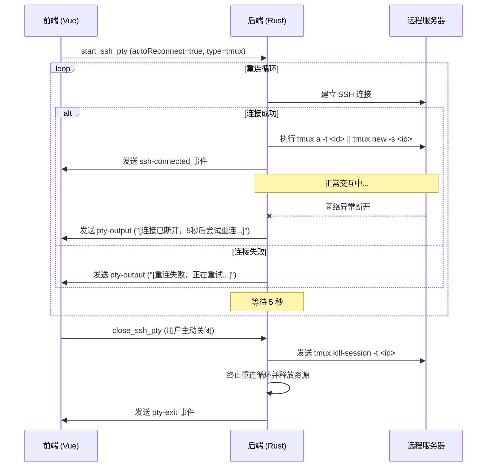

# SSH 自动重连功能设计文档
## 1. 功能概述
实现 SSH 模式下的链接自动重连功能。该功能默认关闭，用户可手动开启。开启后，程序将利用远程服务器上的 `screen` 或 `tmux` 会话来保持终端状态。当网络异常断开时，程序会自动尝试恢复连接并重新附加到之前的会话。只有在用户主动关闭窗口或退出程序时，才会销毁远程会话。
## 2. 核心逻辑设计
### 2.1 会话管理 (Session Management)
- **会话名称**：使用 `at-` 前缀加程序内部生成的 `sessionId` (UUID) 作为远程 `screen` 或 `tmux` 会话名称，例如 `at-<uuid>`，只管理 AuraTerm 创建 de 会话。
- **附加/创建逻辑**：
    - **首次自动重连连接前**：若发现服务器上已有 AuraTerm 创建、当前未附加的 `tmux` / `screen` 会话，则提示用户是否附加到已有会话。
    - **Tmux**: `tmux new-session -A -s at-<sessionId> || tmux attach-session -t at-<sessionId> || tmux new-session -s at-<sessionId>`
    - **Screen**: `screen -dr at-<sessionId> || screen -S at-<sessionId>`
- **环境检测**：连接成功后，首先检测远程服务器是否安装了指定的工具。如果未安装，则自动回退到普通 Shell 模式，并通过终端输出通知用户。
### 2.2 自动重连逻辑 (Auto Reconnect)
- **触发条件**：当 SSH Channel 异常关闭（非用户主动触发 `close_ssh_pty`）时触发。
- **重连策略**：
    - **间隔时间**：固定 5 秒。
    - **尝试次数**：无限次尝试，直到连接成功或用户手动取消。
- **状态反馈**：在重连过程中，终端界面应显示明显的提示信息（如 `[连接已断开，5秒后尝试重连...]`）。
### 2.3 销毁逻辑 (Cleanup)
- **触发条件**：仅在用户点击窗口关闭按钮、关闭标签页或退出程序时触发。
- **销毁指令**：
    - **Tmux**: `tmux kill-session -t at-<sessionId>`
    - **Screen**: `screen -S at-<sessionId> -X quit`
## 3. 模块修改计划
### 3.1 前端 (Frontend)
- **`src/types.ts`**: 更新 `SshConfig` 接口，增加 `autoReconnect: boolean` 和 `reconnectType: 'screen' | 'tmux'` 字段。
- **`src/ConnectDialog.vue`**: 
    - 增加“自动重连”开关。
    - 增加“会话工具”下拉选择框（screen/tmux）。
- **`src/TerminalComponent.vue`**: 
    - 在调用 `start_ssh_pty` 时传递新增的重连参数。
    - 监听重连状态，并在终端输出相关提示。
- **`src/settings.ts`**: 在 `AppSettings` 中添加自动重连的默认配置项。
### 3.2 后端 (Backend - Rust/Tauri)
- **`src-tauri/src/ssh.rs`**:
    - 修改 `start_ssh_pty`：
        - 接收重连参数。
        - 实现基于 `tokio::spawn` 的重连循环。
        - 在连接成功后执行会话附加/创建指令。
    - 修改 `close_ssh_pty`：
        - 接收指令后，先向远程发送销毁会话的命令，再关闭本地连接。
- **`src-tauri/src/settings.rs`**: 同步更新后端设置结构体，确保配置持久化。
## 4. 交互流程图
