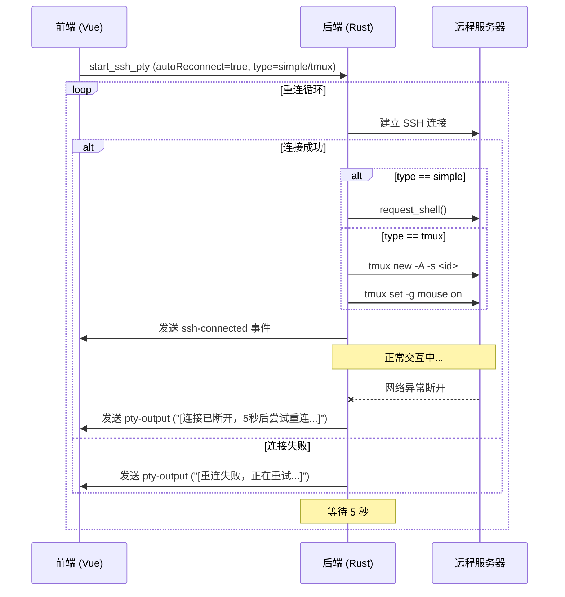

# SSH 自动重连功能设计文档

## 1. 功能概述
实现 SSH 模式下的链接自动重连功能。该功能默认关闭，用户可手动开启。开启后，程序将提供两种重连模式：
1.  **简单重连模式 (Simple Reconnect)**：仅在网络断开后自动尝试重新建立 SSH 连接。不使用任何服务器端会话管理工具。重连后会获得一个新的 Shell 环境，之前的运行状态（如前台任务、环境变量）会丢失，但能保证原生终端体验（如鼠标滚轮）。
2.  **会话保持模式 (Session Persistence)**：利用远程服务器上的 `tmux` 或 `screen` 会话来保持终端状态。当网络异常断开时，程序会自动尝试恢复连接并重新附加到之前的会话。此模式下将自动优化 `tmux` 配置以支持鼠标滚轮。

## 2. 核心逻辑设计

### 2.1 模式定义
- **Simple (简单重连)**:
    - **机制**: 监测 SSH Channel 关闭事件 -> 等待 5 秒 -> 重新发起 SSH 连接 -> 请求 Shell。
    - **优点**: 原生体验，滚轮丝滑，无需服务器依赖。
    - **缺点**: 断线即丢状态。
- **Tmux/Screen (会话保持)**:
    - **机制**: 监测 SSH Channel 关闭事件 -> 等待 5 秒 -> 重新发起 SSH 连接 -> 执行 `tmux attach` / `screen -r`。
    - **优化**: 对于 Tmux 模式，启动时自动注入 `set -g mouse on` 配置，解决滚轮翻页问题。

### 2.2 会话管理 (仅限会话保持模式)
- **会话名称**：使用 `at-` 前缀加程序内部生成的 `sessionId` (UUID) 作为远程 `screen` 或 `tmux` 会话名称，例如 `at-<uuid>`。
- **附加/创建逻辑**：
    - **Tmux**: `tmux new-session -A -s at-<sessionId>` (自动附加或创建)。
        - **鼠标支持**: 在创建/附加后，发送 `tmux set -g mouse on` 指令。
    - **Screen**: `screen -dr at-<sessionId> || screen -S at-<sessionId>`。
- **环境检测**：连接成功后，首先检测远程服务器是否安装了指定的工具。如果未安装，则自动回退到 **简单重连模式**，并通过终端输出通知用户。

### 2.3 自动重连逻辑 (Auto Reconnect)
- **触发条件**：当 SSH Channel 异常关闭（非用户主动触发 `close_ssh_pty`）时触发。
- **重连策略**：
    - **间隔时间**：固定 5 秒。
    - **尝试次数**：无限次尝试，直到连接成功或用户手动取消。
- **状态反馈**：在重连过程中，终端界面应显示明显的提示信息（如 `[连接已断开，5秒后尝试重连...]`）。

### 2.4 销毁逻辑 (Cleanup)
- **触发条件**：仅在用户点击窗口关闭按钮、关闭标签页或退出程序时触发。
- **销毁指令** (仅限会话保持模式)：
    - **Tmux**: `tmux kill-session -t at-<sessionId>`
    - **Screen**: `screen -S at-<sessionId> -X quit`

## 3. 模块修改计划

### 3.1 前端 (Frontend)
- **`src/types.ts`**: 
    - 更新 `SshConfig` 接口，增加 `autoReconnect: boolean`。
    - 增加 `reconnectType: 'simple' | 'tmux' | 'screen'` 字段 (默认为 `simple`)。
- **`src/ConnectDialog.vue`**: 
    - 增加“自动重连”开关。
    - 当开启自动重连时，显示“重连模式”单选框或下拉框：
        - 🟢 简单重连 (推荐，无依赖)
        - 🔄 会话保持 (Tmux)
        - 🔄 会话保持 (Screen)
- **`src/TerminalComponent.vue`**: 
    - 传递新的重连参数给后端。

### 3.2 后端 (Backend - Rust/Tauri)
- **`src-tauri/src/ssh.rs`**:
    - 修改 `ReconnectType` 枚举，增加 `Simple` 变体。
    - 修改 `start_ssh_pty` 和 `do_single_ssh_connect`：
        - 处理 `Simple` 模式：不执行任何 multiplexer 命令，直接请求 Shell。
    - 修改 `open_pty_channel`：
        - 针对 `Tmux` 模式，在连接建立后发送 `tmux set -g mouse on`。
    - 修改 `close_ssh_pty`：
        - `Simple` 模式下不需要发送 kill 命令，直接断开即可。

## 4. 交互流程图 (更新版)

